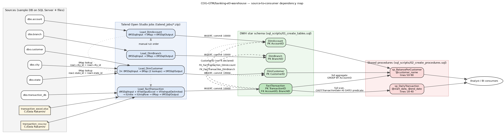
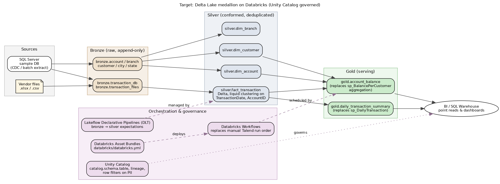

# SQL Server → Databricks migration assessment

Scope: everything in this repository — `sql_scripts/01_create_tables.sql`, `sql_scripts/02_create_procedures.sql`, the four Talend job archives in `talend_jobs/`, and the file sources in `data_sources/`. Every claim below cites a line of that source, a Talend component property extracted from the job `.item` XML, or a documented engine behaviour with a link. No timings are quoted: no SQL Server instance and no Databricks workspace were available in this session, so anything that would need a measurement is written as "measure this" rather than asserted.

Companion deliverable: `databricks/` contains a working PySpark/Delta conversion of `sp_BalancePerCustomer` plus a pytest equivalence suite (11 tests, green — see [§6](#6-validation-strategy)).

---

## 1. Inventory and dependency map



Source: `docs/dependency_graph.dot` (rendered to `docs/dependency-map.png` and `docs/dependency-map.svg` with `dot -Tpng`).

### 1.1 Tables (`sql_scripts/01_create_tables.sql`)

| Table | Grain | Keys declared | Notes |
|---|---|---|---|
| `DimAccount` (line 27) | one row per account | `AccountID` PK (line 28) | `Balance MONEY` (line 31); `CustomerID` has no FK to `DimCustomer` |
| `DimBranch` (line 40) | one row per branch | `BranchID` PK (line 41) | 3 columns, pure lookup |
| `DimCustomer` (line 50) | one row per customer | `CustomerID` PK (line 51) | pre-joined with `city`/`state` by the Talend job; `Age INT` (line 56) |
| `FactTransaction` (line 65) | one row per transaction | `TransactionID` PK (line 66), FK → `DimAccount` (line 74), FK → `DimBranch` (line 75) | `Amount MONEY` (line 69), `TransactionDate DATETIME` (line 68) |

No index other than the four primary keys is created anywhere in the script. In SQL Server a `PRIMARY KEY` defaults to a clustered index, so `FactTransaction` is physically ordered by `TransactionID` and there is **no** index on `AccountID`, `BranchID` or `TransactionDate` — the two columns both stored procedures filter and group on. Every workload in this repository is therefore already a full scan of the fact table today.

### 1.2 Stored procedures (`sql_scripts/02_create_procedures.sql`)

| Procedure | Params | Body | Shape |
|---|---|---|---|
| `sp_DailyTransaction` (lines 18-40) | `@start_date DATE`, `@end_date DATE` | single `SELECT` with `GROUP BY CAST(TransactionDate AS DATE)` | date-ranged aggregation over the fact table |
| `sp_BalancePerCustomer` (lines 50-90) | `@customer_name VARCHAR(100)` | CTE aggregating **all** of `FactTransaction` (lines 58-72), then a 3-way join filtered to one customer (lines 74-89) | full-table aggregation used to answer a point lookup |

### 1.3 Talend jobs (`talend_jobs/*.zip`, project `IDX_INTERNSHIP`)

| Job | Components (in order) | Target | Notable properties |
|---|---|---|---|
| `Load_DimBranch` | `tMSSqlInput` → `tMap` → `tMSSqlOutput` | `context.namaTabel` | `DATA_ACTION=INSERT`, `COMMIT_EVERY=10000` |
| `Load_DimAccount` | `tMSSqlInput` → `tMap` → `tMSSqlOutput` | `context.namaTabelTujuan` | `DATA_ACTION=INSERT`, `COMMIT_EVERY=10000` |
| `Load_DimCustomer` | 3× `tMSSqlInput` → `tMap` (lookups `row1.city_id = row2.city_id`, `row2.state_id = row3.state_id`, both `LOAD_ONCE`/`UNIQUE_MATCH`) → `tMSSqlOutput` | `"DimCustomer"` | applies `StringHandling.UPCASE()` to name, address, gender |
| `Load_FactTransaction` | `tMSSqlInput` + `tFileInputExcel` + `tFileInputDelimited` → `tUnite` → `tUniqRow` (key `transaction_id`) → `tMap` → `tMSSqlOutput` | `context.namaTabelFakta` | file paths hardcoded to `C:/Data Rakamin/…`; `DIE_ON_ERROR=false` on both file inputs and on the output |

Eight distinct sources feed four targets: `dbo.account`, `dbo.branch`, `dbo.customer`, `dbo.city`, `dbo.state`, `dbo.transaction_db`, `transaction_excel.xlsx`, `transaction_csv.csv`. Connections point at `localhost:1433`, databases `sample` and `DWH`, with passwords stored inside the job items as `enc:system.encryption.key.v1:…`.

There is no scheduler, no dependency declaration and no state: the run order (`DimBranch` → `DimAccount` → `DimCustomer` → `FactTransaction`) exists only as prose in `README.md` under "How to Run This Project". That is the orchestration surface Databricks Workflows has to replace, and it is the smallest part of the migration.

---

## 2. Per-procedure and per-job performance analysis for Spark

Each finding names the construct, the exact source line, why it behaves differently on Spark, and the conversion.

### 2.1 `sp_BalancePerCustomer` — full-fact aggregation behind a point lookup

**Lines 58-72.** The `TransactionSummary` CTE reads and groups the entire `FactTransaction` table with no predicate. Lines 86-89 then throw away everything except one customer's active accounts. SQL Server can sometimes rescue this by pushing the join down and seeking, but with no index on `FactTransaction.AccountID` (§1.1) it cannot: the aggregate is computed over the whole table on every call.

On Spark this is worse, not better: the `GROUP BY AccountID` is a shuffle of the full fact table, and per-invocation shuffles are exactly what Spark is bad at. **This is the single most important finding in the assessment** — it is not a translation problem, it is a modelling problem. The conversion in `databricks/src/banking_dwh/balance_per_customer.py` splits it:

* `account_balance()` — the joins and the aggregation, run once per refresh by a Workflow, materialised as the Delta table `gold.account_balance`;
* `serve_from_gold()` — the `@customer_name` predicate, evaluated against the small gold table at query time.

The rewrite is behaviour-preserving for the returned rows (proved by the equivalence tests) and changes the freshness contract from "as of now" to "as of last refresh". That trade must be signed off by the business; if sub-minute freshness is genuinely required for this query, it belongs in the "does not move" bucket in §4.

### 2.2 `sp_BalancePerCustomer` — `LIKE '%' + @param + '%'`

**Line 88.** A leading wildcard makes the predicate non-sargable in SQL Server (no index seek is possible even if an index on `CustomerName` existed). On Spark there are no indexes to lose, but two behaviours change silently:

1. **Collation.** SQL Server's default `SQL_Latin1_General_CP1_CI_AS` is case-insensitive, so `LIKE '%budi%'` matches `BUDI SANTOSO`. Spark string comparison is case-sensitive by default ([Databricks: collation support](https://docs.databricks.com/aws/en/sql/language-manual/sql-ref-collation)), so a literal transliteration returns fewer rows. The conversion lower-cases both sides in `customer_name_matches()`; the test parameters `"budi"`/`"BUDI"` pin this.
2. **`Status = 'active'` (line 89)** has the same problem, and the fixture deliberately contains both `active` and `Active` rows to catch it.

### 2.3 `sp_DailyTransaction` — `CAST(TransactionDate AS DATE)` in the predicate

**Lines 29, 35, 37.** In SQL Server, `CAST(datetime AS date)` is one of the few conversions the optimizer can still seek on ([Microsoft: CAST and CONVERT](https://learn.microsoft.com/en-us/sql/t-sql/functions/cast-and-convert-transact-sql)), so this is *not* a bug in the T-SQL. It becomes a problem after conversion: Delta file pruning uses min/max statistics on the stored column ([Databricks: data skipping](https://docs.databricks.com/aws/en/delta/data-skipping)), and the cleanest way to keep pruning is a half-open range on the raw timestamp column:

```sql
WHERE TransactionDate >= :start_date
  AND TransactionDate <  dateadd(day, 1, :end_date)
```

Same result set, and the predicate is expressed directly on the clustered column. Pair it with liquid clustering on `(TransactionDate, AccountID)` ([Databricks: liquid clustering](https://docs.databricks.com/aws/en/delta/clustering)) rather than partitioning by day — daily partitions on this volume produce small files.

### 2.4 Implicit conversions

Three, all real:

* **`Amount`.** `FactTransaction.Amount` is `MONEY` (line 69), but every Talend schema that carries it types it `id_Integer` (`tUniqRow_1`, `tFileInputExcel_1`, `tFileInputDelimited_1` in `Load_FactTransaction_0.1.item`). Any fractional amount in the CSV or Excel feed is truncated before it ever reaches SQL Server. Spark with ANSI mode on ([Databricks: ANSI compliance](https://docs.databricks.com/aws/en/sql/language-manual/sql-ref-ansi-compliance)) raises instead of truncating — expect the first Databricks run to *fail* on data the Talend job silently accepted, and treat that as the migration finding it is.
* **`Age`.** `DimCustomer.Age` is `INT` (line 56); the `tMap` output entry `Age` is typed `id_String`. SQL Server coerces on insert; Spark's by-name insert into a Delta table will not.
* **`MONEY` arithmetic.** `MONEY` is fixed-point with scale 4 ([Microsoft: money and smallmoney](https://learn.microsoft.com/en-us/sql/t-sql/data-types/money-and-smallmoney-transact-sql)). Converting money to `DOUBLE` in Spark introduces drift in the `SUM` on line 62. The conversion uses `DECIMAL(19, 4)` throughout and the test `test_money_arithmetic_is_exact` pins a sub-cent case.

### 2.5 Row-by-row processing (the Talend equivalent of a cursor)

There is no `CURSOR` or `WHILE` loop in the T-SQL — worth stating plainly, because it removes the usual worst case. The row-at-a-time work lives in Talend instead:

* All four `tMSSqlOutput` components insert inside a JVM loop with `COMMIT_EVERY=10000`; throughput is bounded by one JDBC round trip per row on a single machine. The Spark replacement is one distributed write per job, which is where the throughput gain at 70TB actually comes from.
* `StringHandling.UPCASE()` in `Load_DimCustomer`'s `tMap` is a per-row Java call. It converts to the built-in `upper()`. **Do not** port it as a Python UDF: Python UDFs serialize each row out of the JVM and are opaque to Catalyst ([Databricks: user-defined functions](https://docs.databricks.com/aws/en/udf/)). Built-ins only, and where custom logic is unavoidable, prefer Spark SQL UDFs or pandas UDFs.
* `tUniqRow` (key `transaction_id`) deduplicates in a single-node in-memory structure, so the dedup step is bounded by driver memory today and does not survive a volume increase. In Spark it becomes a distributed `dropDuplicates`/`row_number()` — but note that `tUniqRow` keeps the *first arriving* row, which depends on the `tUnite` input order (DB, then Excel, then CSV). The Spark rewrite must pin that with an explicit source-priority column and `row_number()`, otherwise the survivor becomes nondeterministic and row-level validation against the legacy output will fail intermittently.

### 2.6 MERGE / upsert and reload semantics

No `MERGE` exists anywhere — every job is `DATA_ACTION=INSERT`. The consequence is that the pipeline is not rerunnable: a second run violates the `TransactionID` primary key (line 66). Today that is masked by manual truncates.

The Delta target must make this explicit, and the choice matters:

* **Dimensions** (small, full refresh): `CREATE OR REPLACE TABLE` / `overwrite` — no merge needed, cheapest correct option.
* **Fact** (incremental): `MERGE INTO … ON TransactionID WHEN NOT MATCHED THEN INSERT`. Be aware that Delta MERGE is copy-on-write and rewrites every file containing a touched row; enable deletion vectors to avoid that on update-heavy runs ([Databricks: MERGE INTO](https://docs.databricks.com/aws/en/sql/language-manual/delta-merge-into), [deletion vectors](https://docs.databricks.com/aws/en/delta/deletion-vectors)). At 70TB the difference between a well-clustered merge key and a poorly-clustered one is the difference between rewriting a few files and rewriting the table.

### 2.7 Temp tables and session-scoped T-SQL

No `#temp` chains and no scalar UDFs exist in this codebase — the only intermediate is the CTE at line 58. What does not translate is the session scaffolding: `USE DWH` (line 10), `GO` batch separators, `SET NOCOUNT ON` (lines 25, 55) and `PRINT`. Databricks has no session database; tables are addressed as `catalog.schema.table` through Unity Catalog, which is why the converted module takes fully-qualified names as module constants.

### 2.8 Operational findings in the Talend jobs

| Finding | Evidence | Why it matters for the migration |
|---|---|---|
| Hardcoded Windows paths | `FILENAME = "C:/Data Rakamin/transaction_excel.xlsx"`, `…/transaction_csv.csv` | file ingestion has no environment abstraction; becomes a cloud storage path + Auto Loader |
| Target table names come from context variables | `context.namaTabel`, `context.namaTabelTujuan`, `context.namaTabelFakta` | three of four jobs do not declare their target in version control; the real mapping must be recovered from the Talend runtime config before conversion is provably complete |
| Credentials embedded in job items | `PASSWORD … enc:system.encryption.key.v1:…`, `HOST "localhost"` | must move to Databricks secret scopes; do not carry these values across |
| Errors suppressed | `DIE_ON_ERROR=false` on both file inputs and all outputs | rows are being dropped silently today, so legacy row counts are not automatically the correct target; DLT expectations make the loss countable |
| Date formats differ by source | DB source `DATETIME2`; file sources parsed as `"dd-MM-yyyy HH:mm:ss"` (`tUniqRow` metadata shows `"dd-MM-yyyy"` for the DB branch) | Spark 3 rejects unparseable dates instead of coercing; set the format explicitly per source and decide the `timeParserPolicy` deliberately |

---

## 3. Where Databricks wins, and where it does not

Being straight about this is the point of the assessment.

**Spark/Databricks wins** when the work is scan-heavy and parallelisable: full or wide-range scans of the fact table, multi-source unions, deduplication over the whole history, and any aggregation whose input does not fit comfortably on one machine. Storage is decoupled from compute, so a 70TB historical rebuild scales horizontally in a way a single SQL Server instance cannot.

**SQL Server wins** on small, selective, latency-sensitive work. A clustered-index seek returning a handful of rows is microseconds; the same logical query on Databricks pays query planning plus task scheduling, and a Spark stage has fixed per-job overhead regardless of data size ([Spark: job scheduling](https://spark.apache.org/docs/latest/job-scheduling.html)). Databricks SQL Warehouses narrow that gap considerably but do not close it for single-row point reads.

```
 today (per call)                      after conversion
 ----------------                      ----------------
 caller                                caller
   |                                     |
   v                                     v
 sp_BalancePerCustomer                 gold.account_balance   <-- small, filtered read
   |  scan+GROUP BY whole                    ^
   |  FactTransaction  <-- 70TB              | once per refresh (Workflow)
   v                                         |
 filter to 1 customer                  silver.fact_transaction  <-- 70TB scanned once
```

Concretely for this repository: at the data volume present here (`data_sources/transaction_csv.csv` is 11 data rows) Databricks would be **slower** than SQL Server for both procedures, and any demo that claims otherwise on this dataset is misleading. The migration case rests entirely on the customer's 70TB, not on this sample.

---

## 4. Wave plan

Waves are ordered by (benefit on Databricks) ÷ (behavioural risk), not by convenience.

### Wave 1 — historical fact data and the batch ETL that produces it

* `FactTransaction` history → `bronze.transaction_*` + `silver.fact_transaction` (Delta, liquid clustering on `TransactionDate, AccountID`).
* `Load_FactTransaction` → a Lakeflow Declarative Pipeline: multi-source union (`tUnite`), dedup (`tUniqRow`), typed cast, MERGE on `TransactionID`.
* `Load_DimCustomer`'s two lookup joins → a Spark join; `StringHandling.UPCASE()` → `upper()`.

Why first: largest table, purely scan-shaped, no latency SLA, and it is the workload whose cost curve motivated the migration. It also forces the type-fidelity work (§2.4) early, where it is cheap to fix.

### Wave 2 — batch aggregates and reporting outputs

* `sp_DailyTransaction` → `gold.daily_transaction_summary`, refreshed by a Workflow, with the sargable range predicate from §2.3.
* `sp_BalancePerCustomer`'s aggregation half → `gold.account_balance` (**delivered in `databricks/`**).
* Remaining dimension loads (`Load_DimAccount`, `Load_DimBranch`) — trivial full refreshes, moved for orchestration consistency rather than performance.

Why second: depends on Wave 1 tables, and each conversion needs its own equivalence test before the SQL Server copy can be retired.

### Wave 3 — orchestration and governance cutover

* Manual run order (README) → a Workflow with real task dependencies.
* Everything deployed through Databricks Asset Bundles (`databricks/databricks.yml`).
* Unity Catalog grants, lineage, and row/column masking on the PII in `DimCustomer` (`Email`, `Address`, `Age`, `Gender` — lines 52-58).

### Moves last, or does not move at all

* **The point-read half of `sp_BalancePerCustomer`** (the `@customer_name` filter). If this is called interactively per customer, serve it from `gold.account_balance` through a SQL Warehouse — or leave it on SQL Server against a small replicated table. Do not run a Spark job per lookup.
* **Any single-row OLTP-shaped access to `DimCustomer`/`DimAccount`/`DimBranch`.** These are lookup tables; Databricks adds latency without adding capability. Keep the operational copy where it is and let the lake hold the analytical copy.
* **Anything with a sub-minute freshness SLA** that is currently satisfied by reading the live OLTP tables. Streaming tables can get close, but that is a separate design, not a lift-and-shift.

---

## 5. Target architecture



Source: `docs/target_architecture.dot`.

**Medallion layout (Unity Catalog three-level namespace):**

| Layer | Tables | Contract |
|---|---|---|
| `bronze` | `transaction_db`, `transaction_files`, `account`, `branch`, `customer`, `city`, `state` | raw, append-only, source types preserved, ingestion metadata columns added |
| `silver` | `fact_transaction`, `dim_customer`, `dim_account`, `dim_branch` | conformed types (`DECIMAL(19,4)` money, real timestamps), deduplicated, expectations enforced |
| `gold` | `account_balance`, `daily_transaction_summary` | business-shaped, the tables BI reads |

**Orchestration.** Talend's four jobs and their prose run order become one Workflow with declared task dependencies; the bronze→silver transformations become Lakeflow Declarative Pipelines (DLT) so that data quality expectations replace `DIE_ON_ERROR=false`. Everything is defined as code in `databricks/databricks.yml` + `databricks/resources/*.yml` and deployed with `databricks bundle deploy -t <target>`, which gives dev/prod separation the current setup has no equivalent of.

**Governance.** Unity Catalog replaces the `USE DWH` model: `catalog.schema.table` naming, automatic column-level lineage, grants per schema, and row filters / column masks over the customer PII. Credentials move from encrypted strings inside `.item` files to Databricks secret scopes.

**File ingestion.** `C:/Data Rakamin/*.xlsx|csv` become cloud storage paths read with Auto Loader, giving exactly-once file tracking that the current job has no notion of.

---

## 6. Validation strategy

Four gates, cheapest first. Nothing is signed off on one of them alone.

1. **Row counts** per table, and per `CAST(TransactionDate AS DATE)` bucket for the fact table. Note the trap: `DIE_ON_ERROR=false` (§2.8) means the legacy row count may itself be short of the source. Reconcile source → legacy → Databricks, not just legacy → Databricks.
2. **Schema diff.** Column names, nullability, and type mapping — `MONEY` → `DECIMAL(19,4)`, `DATETIME` → `TIMESTAMP`, `VARCHAR(n)` → `STRING` (Delta does not enforce length; if length is a business rule it becomes an expectation).
3. **Aggregate checksums.** `SUM(Amount)` computed in fixed point (as an integer of ten-thousandths, never a float), `COUNT(DISTINCT AccountID)`, `MIN`/`MAX(TransactionDate)`, and `SUM(CASE WHEN TransactionType = 'Deposit' …)` — the exact expression from line 62, so a sign error cannot pass.
4. **Sampled record equivalence.** Hash the concatenated business columns per `TransactionID` on both sides for a stratified sample (recent partition, oldest partition, the accounts with the highest transaction counts, and every account whose balance is negative) and compare hash sets.

**Delivered harness.** `databricks/tests/test_balance_per_customer_equivalence.py` runs the converted PySpark logic and a SQLite transliteration of the T-SQL body over the same fixture and asserts identical rows and exact decimal values, across eight `@customer_name` values (case variants, wildcard-bearing parameters, no-match, and the `ISNULL` branch).

```
$ cd databricks && pytest -q
...........                                                              [100%]
11 passed in 6.80s
```

What that proves: the conversion preserves row selection and arithmetic, including the four behaviours that differ between the engines (case-insensitive `LIKE`, case-insensitive `Status`, `ISNULL` on an account with no transactions, and fixed-point money). What it does not prove: SQL Server behaviour SQLite cannot host — non-ASCII collation, `LIKE` character classes, `MONEY` overflow, and anything about query plans. `databricks/src/banking_dwh/tsql_reference.py` states this in its own docstring so nobody reads more into a green suite than is there. Before cutover the same assertions should be re-run against the real SQL Server output.

---

## 7. Risk register

| # | Risk | Evidence | Likelihood | Impact | Mitigation |
|---|---|---|---|---|---|
| R1 | Legacy output is already lossy, so "match the old numbers" is the wrong target | `DIE_ON_ERROR=false` on file inputs and all four outputs | High | High | Reconcile source→legacy first; agree in writing whether Databricks reproduces or corrects the loss |
| R2 | Unknown target tables for three of four jobs | `context.namaTabel*` in `Load_DimBranch`, `Load_DimAccount`, `Load_FactTransaction` | High | Medium | Recover the Talend runtime context before conversion sign-off; do not infer from names |
| R3 | Silent truncation of fractional amounts becomes a hard failure | `Amount` typed `id_Integer` vs `MONEY` (line 69) | High | Medium | Type as `DECIMAL(19,4)`, quantify affected rows in bronze, decide correction policy with the business |
| R4 | Case-sensitivity change alters result sets | line 88, line 89 vs Spark's case-sensitive comparison | High | High | Explicit lower-casing (implemented) + collation-focused tests (implemented) |
| R5 | Nondeterministic dedup survivor | `tUniqRow` keeps first-arriving row; `tUnite` order is DB→Excel→CSV | Medium | Medium | Explicit source-priority column + `row_number()`; assert survivor choice in tests |
| R6 | Per-call Spark jobs for point lookups regress user-facing latency | §2.1, §3 | Medium | High | Precompute `gold.account_balance`; serve filters from the gold table or leave point reads on SQL Server |
| R7 | Freshness contract changes from "live" to "last refresh" | §2.1 | High | Medium | Get explicit business sign-off on the refresh SLA before retiring the procedure |
| R8 | MERGE rewrite amplification at 70TB | Delta copy-on-write MERGE | Medium | High | Cluster on the merge key, enable deletion vectors, measure file rewrite volume on a representative slice |
| R9 | Credentials leak during migration | encrypted passwords inside `.item` files | Medium | High | Rotate on cutover; secret scopes only; never copy the strings into the new repo |
| R10 | Small-data workloads regress after being moved for consistency | §3 | Medium | Low | Keep the wave-4 "does not move" list honest; re-measure before moving anything from it |
| R11 | Excel/CSV date parsing differences produce nulls or shifted dates | `"dd-MM-yyyy HH:mm:ss"` vs `DATETIME2` | Medium | Medium | Explicit `to_timestamp` format per source; expectation on null timestamps in DLT |

---

## 8. What was not verified

* No SQL Server instance was available, so no query plan, no measured runtime, and no row count from `sample.bak` is reported here.
* No Databricks workspace was available: the bundle and job YAML are written against the documented schema but have not been deployed, and `refresh_gold_table()` has not been executed against a real Delta table. The transformation it calls is the same function the tests exercise.
* Talend job screenshots inside the archives were not opened; the component graph above comes from the `.item` XML, which is the authoritative definition.
