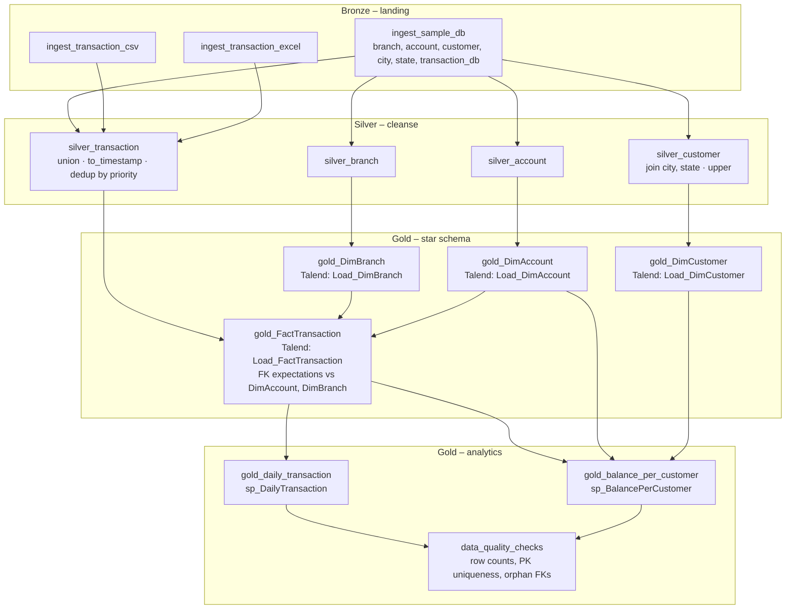

# Databricks Target Design (Medallion / Delta Lake)

Target for the SQL Server + Talend warehouse described in
`talend_mapping_spec.md`. The design keeps the gold star schema identical in
shape and semantics to `sql_scripts/01_create_tables.sql` so that existing
reporting logic (the two stored procedures) can be validated row-for-row during
parallel run.

## 1. Catalog / schema naming

Unity Catalog three-level namespace, one catalog per environment, one schema per
medallion layer:

```
<env>_banking_dwh              -- catalog: dev_banking_dwh | test_banking_dwh | prod_banking_dwh
├── bronze                     -- raw landing, schema-on-read, append-only, source columns as-is
├── silver                     -- typed, cleansed, deduplicated, conformed (snake_case)
└── gold                       -- star schema + analytics outputs, PascalCase (matches DWH DDL)
```

Table naming:

| Layer | Convention | Examples |
|---|---|---|
| bronze | `<source_system>_<object>` | `bronze.sample_account`, `bronze.file_transaction_csv`, `bronze.file_transaction_excel` |
| silver | business entity, snake_case | `silver.customer`, `silver.transaction` |
| gold | exact legacy names | `gold.DimAccount`, `gold.FactTransaction`, `gold.daily_transaction`, `gold.balance_per_customer` |

Local / unit-test fallback: when Unity Catalog and Delta are unavailable, use the
same three-part names under a `spark_catalog` with `hive_metastore`-style schemas,
or parquet paths `<root>/{bronze,silver,gold}/<table>` — the code under
`src/` should resolve names through a single `table_name(layer, table)` helper so
tests can redirect to a temp directory.

Storage layout (Delta): `abfss://<container>@<account>.dfs.core.windows.net/banking_dwh/<layer>/<table>`
(or the S3/GCS equivalent) as external locations owned by the catalog; managed
tables are acceptable for dev.

## 2. Bronze – raw landing

One table per source object, append-only, all columns as `STRING` except where the
reader gives a native type, plus ingestion metadata. Delta `mergeSchema` enabled.

| Bronze table | Source | Reader | Notes |
|---|---|---|---|
| `bronze.sample_branch` | `sample.dbo.branch` | JDBC (`com.microsoft.sqlserver.jdbc.spark` or built-in `jdbc`) full extract | 3 cols |
| `bronze.sample_account` | `sample.dbo.account` | JDBC full extract | 6 cols |
| `bronze.sample_customer` | `sample.dbo.customer` | JDBC full extract | 7 cols |
| `bronze.sample_city` | `sample.dbo.city` | JDBC full extract | 3 cols |
| `bronze.sample_state` | `sample.dbo.state` | JDBC full extract | 2 cols |
| `bronze.sample_transaction_db` | `sample.dbo.transaction_db` | JDBC full extract | 6 cols |
| `bronze.file_transaction_csv` | `data_sources/transaction_csv.csv` (landing volume `/Volumes/<catalog>/bronze/landing/csv/`) | `spark.read.csv(header=True, inferSchema=False)` → all `STRING` | keep `transaction_date` as raw string `dd-MM-yyyy HH:mm:ss` |
| `bronze.file_transaction_excel` | `data_sources/transaction_excel.xlsx` (landing volume `.../excel/`) | pandas + openpyxl → `spark.createDataFrame`, or `com.crealytics:spark-excel` | `transaction_date` arrives as a native timestamp |

Metadata columns added to every bronze table:

| Column | Type | Value |
|---|---|---|
| `_ingest_ts` | `TIMESTAMP` | `current_timestamp()` |
| `_source_system` | `STRING` | `sample_db` \| `file_csv` \| `file_excel` |
| `_source_file` | `STRING` | `input_file_name()` / JDBC table name |
| `_batch_id` | `STRING` | run identifier (job run id) |

For the one-off migration, `sample.bak` is restored to a SQL Server (Azure SQL /
container) and pulled via JDBC once; thereafter bronze is fed by whatever
replaces the OLTP feed (CDC, nightly extract). Bronze retains history
(append); silver/gold are rebuilt from the latest `_batch_id`.

## 3. Silver – cleansed and conformed

Typed Delta tables in snake_case, one row per natural key, Talend-equivalent
transforms applied. Written with `mode("overwrite")` per batch (matches the
snapshot semantics of the legacy jobs).

| Silver table | From | Transformations | Constraints / expectations |
|---|---|---|---|
| `silver.branch` | `bronze.sample_branch` | cast `branch_id INT`; `branch_name`, `branch_location STRING` | `branch_id NOT NULL`, unique |
| `silver.account` | `bronze.sample_account` | cast `account_id INT`, `customer_id INT`, `balance DECIMAL(19,4)`, `date_opened DATE` (`to_date(.., 'dd-MM-yyyy')` if string), `status STRING` | `account_id NOT NULL`, unique |
| `silver.customer` | `bronze.sample_customer` LEFT JOIN `bronze.sample_city` ON `city_id` LEFT JOIN `bronze.sample_state` ON `city.state_id = state.state_id` | `upper(customer_name)`, `upper(address)`, `upper(gender)`; `age` cast `INT` (`try_cast` → null + quarantine row); keep `city_name`, `state_name` as-is | `customer_id NOT NULL`, unique; lookups deduplicated on key before join to honour tMap `UNIQUE_MATCH` |
| `silver.transaction` | union of the three transaction bronze tables | see below | `transaction_id NOT NULL`, unique; `amount >= 0`; `transaction_type IN ('Deposit','Withdrawal','Transfer','Payment')` (warn, not fail) |

`silver.transaction` build (replaces `tUnite` + `tUniqRow`):

```python
db    = bronze_tx_db.select(cols).withColumn("_src_priority", F.lit(1))
excel = bronze_tx_excel.select(cols).withColumn("_src_priority", F.lit(2))
csv   = (bronze_tx_csv
         .withColumn("transaction_date", F.to_timestamp("transaction_date", "dd-MM-yyyy HH:mm:ss"))
         .select(cols).withColumn("_src_priority", F.lit(3)))

unified = db.unionByName(excel).unionByName(csv)
w = Window.partitionBy("transaction_id").orderBy("_src_priority", "_ingest_ts")
silver_tx = (unified.withColumn("_rn", F.row_number().over(w))
             .filter("_rn = 1").drop("_rn", "_src_priority"))
```

Precedence `transaction_db` (1) > excel (2) > csv (3) is an explicit decision: Talend's
`tUniqRow` kept "first seen" with non-deterministic tUnite ordering. Duplicates
that are dropped are written to `silver.transaction_duplicates` (the tUniqRow
`DUPLICATE` flow, which Talend discarded) for auditability.

Silver column types:

| Column | Type |
|---|---|
| `transaction_id` | `INT` |
| `account_id` | `INT` |
| `transaction_date` | `TIMESTAMP` |
| `amount` | `DECIMAL(19,4)` |
| `transaction_type` | `STRING` |
| `branch_id` | `INT` |
| `_source_system`, `_ingest_ts`, `_batch_id` | carried from bronze |

## 4. Gold – star schema and analytics outputs

Gold tables reproduce the `DWH` DDL exactly (names, column order, PK/FK
semantics) so parity tests can compare against SQL Server extracts.

### 4.1 Dimensions and fact

| Gold table | Source | Columns (type) | Delta constraints |
|---|---|---|---|
| `gold.DimBranch` | `silver.branch` | `BranchID INT, BranchName STRING, BranchLocation STRING` | `BranchID NOT NULL`; `CHECK`-style uniqueness enforced pre-write |
| `gold.DimAccount` | `silver.account` | `AccountID INT, CustomerID INT, AccountType STRING, Balance DECIMAL(19,4), DateOpened DATE, Status STRING` | `AccountID NOT NULL` |
| `gold.DimCustomer` | `silver.customer` | `CustomerID INT, CustomerName STRING, Address STRING, CityName STRING, StateName STRING, Age INT, Gender STRING, Email STRING` | `CustomerID NOT NULL` |
| `gold.FactTransaction` | `silver.transaction` | `TransactionID INT, AccountID INT, TransactionDate TIMESTAMP, Amount DECIMAL(19,4), TransactionType STRING, BranchID INT` | `TransactionID NOT NULL`; FK checks as anti-join expectations (`AccountID IN DimAccount`, `BranchID IN DimBranch`) — orphans go to `gold.FactTransaction_rejects` instead of failing, or fail-fast per environment flag |

Write mode: `overwrite` with `overwriteSchema=false` for every gold table on each
run. This makes the dimension loads idempotent (the legacy `CREATE_IF_NOT_EXISTS`
+ `INSERT` was not) and matches the fact `TRUNCATE` + `INSERT`. If incremental
loads are introduced later, switch to `MERGE INTO ... ON <natural key>`.

Optional Unity Catalog informational constraints (not enforced, used by the
optimizer and for documentation):

```sql
ALTER TABLE gold.DimAccount      ADD CONSTRAINT pk_dimaccount      PRIMARY KEY (AccountID);
ALTER TABLE gold.DimBranch       ADD CONSTRAINT pk_dimbranch       PRIMARY KEY (BranchID);
ALTER TABLE gold.DimCustomer     ADD CONSTRAINT pk_dimcustomer     PRIMARY KEY (CustomerID);
ALTER TABLE gold.FactTransaction ADD CONSTRAINT pk_facttransaction PRIMARY KEY (TransactionID);
ALTER TABLE gold.FactTransaction ADD CONSTRAINT fk_fact_account FOREIGN KEY (AccountID) REFERENCES gold.DimAccount(AccountID);
ALTER TABLE gold.FactTransaction ADD CONSTRAINT fk_fact_branch  FOREIGN KEY (BranchID)  REFERENCES gold.DimBranch(BranchID);
```

Physical layout: tables are small (sample data: tens of rows); no partitioning.
For production volumes, `FactTransaction` gets `CLUSTER BY (TransactionDate)`
(liquid clustering) or `ZORDER BY (AccountID, TransactionDate)`.

### 4.2 Analytics outputs (stored-procedure replacements)

Stored procedures become parameterised gold views / functions plus optional
materialised tables.

**`gold.daily_transaction`** (replaces `sp_DailyTransaction`) — materialised
Delta table over the full history; the date-range parameter becomes a `WHERE`
at query time:

```sql
CREATE OR REPLACE TABLE gold.daily_transaction AS
SELECT to_date(TransactionDate)  AS Date,
       count(TransactionID)       AS TotalTransactions,
       sum(Amount)                AS TotalAmount
FROM gold.FactTransaction
GROUP BY to_date(TransactionDate);
-- consumer: SELECT * FROM gold.daily_transaction WHERE Date BETWEEN :start_date AND :end_date ORDER BY Date;
```

**`gold.balance_per_customer`** (replaces `sp_BalancePerCustomer`) — materialised
for all active accounts; the name filter becomes a predicate. A SQL table-valued
function is also provided for callers that want the procedure signature:

```sql
CREATE OR REPLACE TABLE gold.balance_per_customer AS
WITH TransactionSummary AS (
  SELECT AccountID,
         sum(CASE WHEN TransactionType = 'Deposit' THEN Amount ELSE -Amount END) AS TotalTransactionAmount
  FROM gold.FactTransaction GROUP BY AccountID)
SELECT c.CustomerID, c.CustomerName, a.AccountID, a.AccountType,
       a.Balance                                             AS InitialBalance,
       a.Balance + coalesce(ts.TotalTransactionAmount, 0)    AS CurrentBalance
FROM gold.DimCustomer c
JOIN gold.DimAccount a ON c.CustomerID = a.CustomerID
LEFT JOIN TransactionSummary ts ON a.AccountID = ts.AccountID
WHERE lower(a.Status) = 'active';

CREATE OR REPLACE FUNCTION gold.fn_balance_per_customer(customer_name STRING)
RETURNS TABLE (CustomerName STRING, AccountType STRING, InitialBalance DECIMAL(19,4), CurrentBalance DECIMAL(19,4))
RETURN SELECT CustomerName, AccountType, InitialBalance, CurrentBalance
       FROM gold.balance_per_customer
       WHERE upper(CustomerName) LIKE concat('%', upper(customer_name), '%');
```

`upper()`/`lower()` are required because SQL Server's default collation is
case-insensitive and Spark is not (see `tsql_to_pyspark_notes.md`).

## 5. Job DAG

Databricks Workflow `banking_dwh_daily` (or a Delta Live Tables pipeline with the
same dependency graph). Task order mirrors the Talend run order; parallel
branches are used where the legacy order was only conventional.

Rendered image:  (source below).



Task list (Databricks Workflows JSON `depends_on`):

| Task key | Depends on | Notebook / entry point |
|---|---|---|
| `ingest_sample_db` | – | bronze JDBC extract of the six `sample` tables |
| `ingest_transaction_csv` | – | bronze CSV landing |
| `ingest_transaction_excel` | – | bronze Excel landing |
| `silver_branch` | `ingest_sample_db` | |
| `silver_account` | `ingest_sample_db` | |
| `silver_customer` | `ingest_sample_db` | |
| `silver_transaction` | `ingest_sample_db`, `ingest_transaction_csv`, `ingest_transaction_excel` | |
| `gold_DimBranch` | `silver_branch` | Load_DimBranch equivalent |
| `gold_DimAccount` | `silver_account` | Load_DimAccount equivalent |
| `gold_DimCustomer` | `silver_customer` | Load_DimCustomer equivalent |
| `gold_FactTransaction` | `silver_transaction`, `gold_DimBranch`, `gold_DimAccount` | Load_FactTransaction equivalent |
| `gold_daily_transaction` | `gold_FactTransaction` | sp_DailyTransaction |
| `gold_balance_per_customer` | `gold_FactTransaction`, `gold_DimAccount`, `gold_DimCustomer` | sp_BalancePerCustomer |
| `data_quality_checks` | `gold_daily_transaction`, `gold_balance_per_customer` | parity / DQ assertions |

The strict legacy sequence DimBranch → DimAccount → DimCustomer → FactTransaction →
analytics is a valid topological order of this DAG; the DAG additionally allows
the three dimension branches to run concurrently.

## 6. Parity / cut-over checks

For the parallel-run phase, compare Databricks gold against the SQL Server `DWH`:

| Check | Method |
|---|---|
| Row counts per gold table | `count(*)` both sides |
| PK uniqueness | `count(*) = count(distinct pk)` |
| FK orphans | anti-join `FactTransaction` ↔ `DimAccount`, `DimBranch` = 0 rows |
| Content hash | `sha2(concat_ws('|', *cols))` per row, sort, compare; cast `MONEY` to `DECIMAL(19,4)` and `DATETIME` to `TIMESTAMP` (truncated to ms) on the SQL Server side before hashing |
| `sp_DailyTransaction` vs `gold.daily_transaction` | run for the full date range, compare `TotalTransactions`, `TotalAmount` per day |
| `sp_BalancePerCustomer` vs `gold.fn_balance_per_customer` | run for every distinct `CustomerName`, compare result sets |

Known deltas to expect and accept: dedup winner for overlapping `transaction_id`
across sources (Talend non-deterministic, Databricks deterministic by
priority); `DATETIME` 3.33 ms rounding vs. `TIMESTAMP` microsecond precision.
