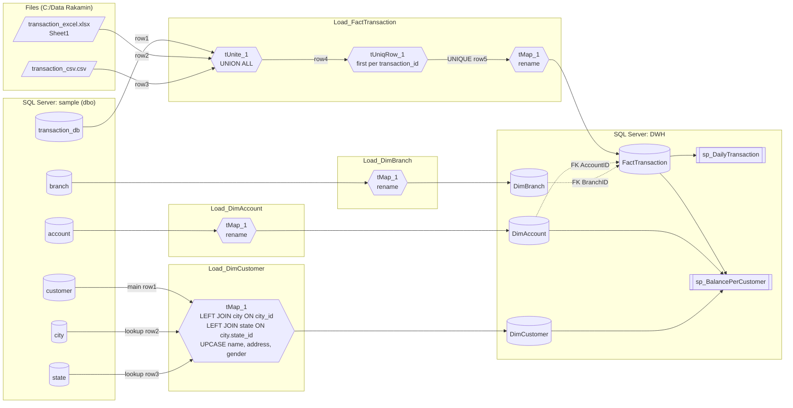

# Talend Job Reverse-Engineering & Source-to-Target Mapping Spec

Source of truth: the four exported jobs in `talend_jobs/*.zip` (Talend Open Studio
for Data Integration 8.0.1, project `IDX_INTERNSHIP`). Each archive contains
`process/<Job>_0.1.item` (the job graph, component parameters and tMap
`MapperData`) plus two shared repository connections under `metadata/connections/`.
Everything below was extracted from those XML files and from the actual files in
`data_sources/`; nothing was inferred from the README alone.

## 1. Shared connection metadata

| Repository connection | JDBC URL | Role |
|---|---|---|
| `Sample_DB_Connection` | `jdbc:sqlserver://localhost:1433;DatabaseName=sample;noDatetimeStringSync=true;trustServerCertificate=true;integratedSecurity=true` | Source OLTP database (`sample`, schema `dbo`), restored from `data_sources/sample.bak` |
| `DWH_DB_Connection` | `jdbc:sqlserver://localhost:1433;DatabaseName=DWH;...` | Target star schema (`DWH`, default schema) |

All `tMSSqlInput` components use `MAPPING = id_MSSQL`, encoding `ISO-8859-15`,
`TRIM = false` on every column. All `tMSSqlOutput` components use
`DATA_ACTION = INSERT`, `BATCH_SIZE = 10000`, `COMMIT_EVERY = 10000`, no update /
delete keys, and expose a `REJECT` flow (unused – nothing is wired to it).

Target table names are supplied through job-level context variables
(`context.namaTabel*`, Indonesian for "target table name"); only
`Load_DimCustomer` hard-codes `"DimCustomer"`.

| Job | Context variable | Default value | `TABLE_ACTION` | Identity column |
|---|---|---|---|---|
| `Load_DimBranch` | `context.namaTabel` | `"DimBranch"` | `CREATE_IF_NOT_EXISTS` | `BranchID` |
| `Load_DimAccount` | `context.namaTabelTujuan` | `"DimAccount"` | `CREATE_IF_NOT_EXISTS` | `AccountID` |
| `Load_DimCustomer` | `context.namaTabelCustomer` (declared, **not used** – literal `"DimCustomer"`) | `"DimCustomer"` | `CREATE_IF_NOT_EXISTS` | `CustomerID` |
| `Load_FactTransaction` | `context.namaTabelFakta` | `"FactTransaction"` | **`TRUNCATE`** then insert | `TransactionID` |

Behavioural consequences for the migration:

* Dimension jobs are append-only (`CREATE_IF_NOT_EXISTS` + `INSERT`). Re-running
  them against an already-loaded `DWH` raises PK violations on the dimension PKs
  declared in `sql_scripts/01_create_tables.sql`. The Databricks design should
  make dimension loads idempotent (full overwrite or `MERGE` on the natural key).
* The fact job is a full reload (`TRUNCATE` + `INSERT`) – i.e. a snapshot/overwrite
  pattern, not incremental.
* `IDENTITY_FIELD` is set on each output, but the source key is mapped straight
  through (`row1.account_id -> AccountID`), so the DWH keys **equal the source
  natural keys**. There is no surrogate-key generation to replicate.

## 2. Job execution order

The jobs are independent Talend jobs (no `tRunJob` orchestrator in the export).
The README-documented run order, which also satisfies the FK constraints on
`FactTransaction` (`AccountID -> DimAccount`, `BranchID -> DimBranch`), is:

1. `Load_DimBranch`
2. `Load_DimAccount`
3. `Load_DimCustomer`
4. `Load_FactTransaction`
5. Stored procedures `sp_DailyTransaction`, `sp_BalancePerCustomer` (queried on demand)

Only step 4 truly depends on steps 1–2 (FK targets). Steps 1–3 can run in parallel.

## 3. Job-by-job specification

### 3.1 `Load_DimBranch`

Graph: `tDBInput_1 (tMSSqlInput) --row1--> tMap_1 --to_DimBranch--> tDBOutput_1 (tMSSqlOutput)`

Input query:

```sql
SELECT dbo.branch.branch_id, dbo.branch.branch_name, dbo.branch.branch_location
FROM dbo.branch
```

| Source (sample.dbo.branch) | Talend type | Transform (tMap expr) | Target DWH.DimBranch | Target DDL type |
|---|---|---|---|---|
| `branch_id` (key) | `id_Integer(10)` | `row1.branch_id` | `BranchID` (PK) | `INT` |
| `branch_name` | `id_String(50)` | `row1.branch_name` | `BranchName` | `VARCHAR(100)` |
| `branch_location` | `id_String(50)` | `row1.branch_location` | `BranchLocation` | `VARCHAR(255)` |

No joins, filters, or expressions – a rename-only pass-through.

### 3.2 `Load_DimAccount`

Graph: `tDBInput_1 --row1--> tMap_1 --to_DimAccount--> tDBOutput_1`

Input query:

```sql
SELECT dbo.account.account_id, dbo.account.customer_id, dbo.account.account_type,
       dbo.account.balance, dbo.account.date_opened, dbo.account.status
FROM dbo.account
```

| Source (sample.dbo.account) | Talend type | Transform | Target DWH.DimAccount | Target DDL type | Notes |
|---|---|---|---|---|---|
| `account_id` (key) | `id_Integer(10)` | `row1.account_id` | `AccountID` (PK) | `INT` | |
| `customer_id` | `id_Integer(10)` | `row1.customer_id` | `CustomerID` | `INT` | logical FK to DimCustomer (not declared) |
| `account_type` | `id_String(10)` | `row1.account_type` | `AccountType` | `VARCHAR(50)` | |
| `balance` | `id_Integer(10)` | `row1.balance` | `Balance` | `MONEY` | Talend reads as Java `Integer`; SQL Server implicitly widens to `MONEY` on insert. Fractional balances are impossible through this pipeline. |
| `date_opened` | `id_Date`, pattern `dd-MM-yyyy` | `row1.date_opened` | `DateOpened` | `DATE` | |
| `status` | `id_String(10)` | `row1.status` | `Status` | `VARCHAR(50)` | Consumed as `Status = 'active'` (case-insensitive under default SQL Server collation) by `sp_BalancePerCustomer` |

No joins or expressions.

### 3.3 `Load_DimCustomer`

Graph:

```
tDBInput_1 (customer) --row1 (main)--> tMap_1 --to_DimCustomer--> tDBOutput_1
tDBInput_2 (city)     --row2 (lookup)-^
tDBInput_3 (state)    --row3 (lookup)-^
```

Input queries:

```sql
SELECT dbo.customer.customer_id, dbo.customer.customer_name, dbo.customer.address,
       dbo.customer.city_id, dbo.customer.age, dbo.customer.gender, dbo.customer.email
FROM dbo.customer;
SELECT dbo.city.city_id, dbo.city.city_name, dbo.city.state_id FROM dbo.city;
SELECT dbo.state.state_id, dbo.state.state_name FROM dbo.state;
```

tMap join configuration (from `MapperData/inputTables`):

| Lookup | Join key expression | `matchingMode` | `innerJoin` | `lookupMode` |
|---|---|---|---|---|
| `row2` (city) | `row2.city_id = row1.city_id` | `UNIQUE_MATCH` | not set (**left outer**) | `LOAD_ONCE` |
| `row3` (state) | `row3.state_id = row2.state_id` | `UNIQUE_MATCH` | not set (**left outer**) | `LOAD_ONCE` |

Semantics: main flow = `customer`; each lookup returns at most one match
(`UNIQUE_MATCH` = last matching row wins if duplicates exist); unmatched customers
are **kept** with `NULL` city/state (Talend default when *Inner join* is unchecked).
The state lookup is chained through the city lookup (`row2.state_id`), so a
customer with no city also gets `StateName = NULL`.

Equivalent SQL:

```sql
SELECT c.customer_id, UPPER(c.customer_name), UPPER(c.address), c.age,
       UPPER(c.gender), c.email, ci.city_name, s.state_name
FROM customer c
LEFT JOIN city  ci ON ci.city_id  = c.city_id
LEFT JOIN state s  ON s.state_id = ci.state_id
```

Column mapping:

| Source | Talend type | Transform (tMap expr) | Target DWH.DimCustomer | Target DDL type | Notes |
|---|---|---|---|---|---|
| `customer.customer_id` (key) | `id_Integer(10)` | `row1.customer_id` | `CustomerID` (PK) | `INT` | |
| `customer.customer_name` | `id_String(50)` | `StringHandling.UPCASE(row1.customer_name)` | `CustomerName` | `VARCHAR(100)` | upper-case; `UPCASE` returns `null` for `null` input |
| `customer.address` | `id_String(2147483647)` | `StringHandling.UPCASE(row1.address)` | `Address` | `VARCHAR(255)` | upper-case; source length is `nvarchar(max)`-like |
| `customer.age` | `id_String(3)` | `row1.age` | `Age` | `INT` | **type mismatch**: Talend carries `age` as a 3-char string; SQL Server implicitly converts on insert (fails on non-numeric). Migration should cast explicitly to `INT`. |
| `customer.gender` | `id_String(10)` | `StringHandling.UPCASE(row1.gender)` | `Gender` | `VARCHAR(10)` | upper-case |
| `customer.email` | `id_String(50)` | `row1.email` | `Email` | `VARCHAR(100)` | not upper-cased |
| `city.city_name` | `id_String(50)` | `row2.city_name` | `CityName` | `VARCHAR(100)` | not upper-cased |
| `state.state_name` | `id_String(50)` | `row3.state_name` | `StateName` | `VARCHAR(100)` | not upper-cased |

The tMap output column order is `CustomerID, CustomerName, Address, Age, Gender,
Email, CityName, StateName`; the DDL order differs (`...Address, CityName,
StateName, Age, Gender, Email`). Talend maps by column name, so this is cosmetic.

No `TRIM` is applied anywhere (all `TRIM = false`); only `UPCASE`.

### 3.4 `Load_FactTransaction`

Graph:

```
tDBInput_1 (sample.dbo.transaction_db)  --row1--> tUnite_1 --row4--> tUniqRow_1 --row5 (UNIQUE)--> tMap_1 --to_FactTransaction--> tDBOutput_1
tFileInputExcel_1 (transaction_excel.xlsx) --row2-^
tFileInputDelimited_1 (transaction_csv.csv) --row3-^
```

Input 1 – SQL Server:

```sql
SELECT dbo.transaction_db.transaction_id, dbo.transaction_db.account_id,
       dbo.transaction_db.transaction_date, dbo.transaction_db.amount,
       dbo.transaction_db.transaction_type, dbo.transaction_db.branch_id
FROM dbo.transaction_db
```

Input 2 – `tFileInputExcel_1`: `FILENAME = "C:/Data Rakamin/transaction_excel.xlsx"`,
`VERSION_2007 = true` (xlsx), sheet `"Sheet1"`, `HEADER = 1`, `FOOTER = 0`,
`FIRST_COLUMN = 1`, thousands separator `,`, decimal separator `.`.

Input 3 – `tFileInputDelimited_1`: `FILENAME = "C:/Data Rakamin/transaction_csv.csv"`,
field separator `,`, row separator `\n`, text enclosure and escape `"`,
`HEADER = 1`, `FOOTER = 0`, `REMOVE_EMPTY_ROW = true`, encoding `ISO-8859-15`.

Common schema declared on all three inputs, `tUnite_1`, `tUniqRow_1`:

| Column | Talend type | Date pattern (file inputs) | Key |
|---|---|---|---|
| `transaction_id` | `id_Integer` | | yes |
| `account_id` | `id_Integer` | | |
| `transaction_date` | `id_Date` | `dd-MM-yyyy HH:mm:ss` | |
| `amount` | `id_Integer` | | |
| `transaction_type` | `id_String(50)` | | |
| `branch_id` | `id_Integer` | | |

`tUnite_1` – positional union of `row1`, `row2`, `row3` (UNION ALL, no dedup,
identical schemas). Input order is DB, Excel, CSV in the graph but Talend
tUnite does not guarantee inter-flow ordering.

`tUniqRow_1` – `KEY_ATTRIBUTE = true` on `transaction_id` only
(`CASE_SENSITIVE = false`, irrelevant for an integer). Semantics: **keep the first
row seen per `transaction_id`**, route later duplicates to the `DUPLICATE` flow
(not connected → discarded). Because tUnite order is not deterministic, which
source "wins" for an overlapping `transaction_id` is undefined in Talend. The
Databricks implementation must choose an explicit precedence (recommended:
`transaction_db` > excel > csv, see `databricks_target_design.md`) and document it.

Observed overlap in the sample data: `transaction_id` 14 and 15 appear in **both**
the Excel and the CSV with identical values, so the sample dedup is
value-insensitive; the DB table contents (`sample.bak`) could not be inspected
locally and may overlap further.

`tMap_1` – rename-only, single input `row5`:

| Source (unified stream) | Transform | Target DWH.FactTransaction | Target DDL type | Notes |
|---|---|---|---|---|
| `transaction_id` | `row5.transaction_id` | `TransactionID` (PK) | `INT` | |
| `account_id` | `row5.account_id` | `AccountID` | `INT` | FK → `DimAccount.AccountID` |
| `transaction_date` | `row5.transaction_date` | `TransactionDate` | `DATETIME` | Talend `Date` (java.util.Date) carries time; the `dd-MM-yyyy` pattern on the DB/tMap schema only affects string formatting |
| `amount` | `row5.amount` | `Amount` | `MONEY` | whole-number amounts (IDR); Integer → MONEY implicit widening |
| `transaction_type` | `row5.transaction_type` | `TransactionType` | `VARCHAR(50)` | values seen: `Deposit`, `Withdrawal`, `Transfer`, `Payment` |
| `branch_id` | `row5.branch_id` | `BranchID` | `INT` | FK → `DimBranch.BranchID` |

Output: `TABLE_ACTION = TRUNCATE`, `DATA_ACTION = INSERT` (full reload).

## 4. Actual file schemas (`data_sources/`)

Inspected with pandas/openpyxl.

### `transaction_csv.csv` (12 data rows + header)

| Column | Inferred type | Example | Notes |
|---|---|---|---|
| `transaction_id` | int64 | `14` | 14–25 |
| `account_id` | int64 | `13` | |
| `transaction_date` | **string** `dd-MM-yyyy HH:mm:ss` | `21-01-2024 14:00:00` | day-first; must be parsed with pattern `dd-MM-yyyy HH:mm:ss`, **not** Spark's default `yyyy-MM-dd` |
| `amount` | int64 | `1500000` | |
| `transaction_type` | string | `Deposit` | `Deposit`, `Transfer`, `Withdrawal`, `Payment` |
| `branch_id` | int64 | `4` | |

### `transaction_excel.xlsx` (sheet `Sheet1`, 7 data rows + header)

| Column | openpyxl / pandas type | Example | Notes |
|---|---|---|---|
| `transaction_id` | int64 | `6` | 6, 7, 11–15 |
| `account_id` | int64 | `6` | |
| `transaction_date` | **native Excel datetime** (`datetime64[ns]`) | `2024-01-18 13:10:00` | already a date cell, no string parsing needed |
| `amount` | int64 | `50000` | |
| `transaction_type` | string | `Withdrawal` | |
| `branch_id` | int64 | `1` | |

Header names in both files match the Talend schema and the `sample.dbo.transaction_db`
columns exactly (snake_case), so the union is by position *and* by name.

### `sample.bak`

SQL Server native backup; cannot be opened without a SQL Server instance. Source
table structures used by the jobs, as declared in the Talend input schemas:

| Table | Columns (Talend type, length) |
|---|---|
| `dbo.branch` | `branch_id` int PK, `branch_name` str(50), `branch_location` str(50) |
| `dbo.account` | `account_id` int PK, `customer_id` int, `account_type` str(10), `balance` int, `date_opened` date, `status` str(10) |
| `dbo.customer` | `customer_id` int PK, `customer_name` str(50), `address` str(max), `city_id` int, `age` str(3), `gender` str(10), `email` str(50) |
| `dbo.city` | `city_id` int PK, `city_name` str(50), `state_id` int |
| `dbo.state` | `state_id` int PK, `state_name` str(50) |
| `dbo.transaction_db` | `transaction_id` int PK, `account_id` int, `transaction_date` date(time), `amount` int, `transaction_type` str(50), `branch_id` int |

## 5. Downstream consumers (stored procedures)

Both procedures in `sql_scripts/02_create_procedures.sql` read only the gold tables;
their logic is specified here so the Databricks gold layer can reproduce them.

**`sp_DailyTransaction(@start_date DATE, @end_date DATE)`**

```sql
SELECT CAST(TransactionDate AS DATE) AS [Date],
       COUNT(TransactionID) AS TotalTransactions,
       SUM(Amount)          AS TotalAmount
FROM FactTransaction
WHERE CAST(TransactionDate AS DATE) BETWEEN @start_date AND @end_date
GROUP BY CAST(TransactionDate AS DATE)
ORDER BY [Date];
```

**`sp_BalancePerCustomer(@customer_name VARCHAR(100))`**

```sql
WITH TransactionSummary AS (
  SELECT AccountID,
         SUM(CASE WHEN TransactionType = 'Deposit' THEN Amount ELSE -Amount END) AS TotalTransactionAmount
  FROM FactTransaction GROUP BY AccountID)
SELECT c.CustomerName, a.AccountType, a.Balance AS InitialBalance,
       a.Balance + ISNULL(ts.TotalTransactionAmount, 0) AS CurrentBalance
FROM DimCustomer c
JOIN DimAccount a ON c.CustomerID = a.CustomerID
LEFT JOIN TransactionSummary ts ON a.AccountID = ts.AccountID
WHERE c.CustomerName LIKE '%' + @customer_name + '%' AND a.Status = 'active';
```

Note the interaction with `Load_DimCustomer`: `CustomerName` is stored upper-cased,
and SQL Server's default collation is case-insensitive, so `LIKE '%john%'` matches
`'JOHN DOE'`. In Spark, string comparison is case-sensitive; the gold query must
upper-case the parameter (or use `ilike`). Likewise `Status = 'active'` must be
compared case-insensitively (`lower(Status) = 'active'`).

## 6. Lineage diagram

Rendered image:  (source below).



## 7. Summary of transforms to reproduce

| # | Transform | Where | PySpark equivalent |
|---|---|---|---|
| T1 | snake_case → PascalCase rename | all four tMaps | `withColumnsRenamed({...})` |
| T2 | `StringHandling.UPCASE` on `customer_name`, `address`, `gender` | `Load_DimCustomer` | `F.upper(col)` |
| T3 | Left-outer lookup `customer.city_id = city.city_id` (unique match) | `Load_DimCustomer` | `customer.join(city, "city_id", "left")` |
| T4 | Left-outer lookup `city.state_id = state.state_id` (unique match) | `Load_DimCustomer` | `.join(state, "state_id", "left")` |
| T5 | `age` string → `INT` (implicit in SQL Server) | `Load_DimCustomer` | `F.col("age").cast("int")` |
| T6 | Parse `dd-MM-yyyy HH:mm:ss` strings from CSV | `Load_FactTransaction` | `F.to_timestamp(col, "dd-MM-yyyy HH:mm:ss")` |
| T7 | Read Excel datetime cells as timestamp | `Load_FactTransaction` | pandas/openpyxl → Spark, or `com.crealytics.spark.excel` |
| T8 | UNION ALL of three 6-column streams | `tUnite_1` | `df1.unionByName(df2).unionByName(df3)` |
| T9 | Dedup on `transaction_id`, keep first | `tUniqRow_1` | `Window.partitionBy("transaction_id").orderBy(source_priority)` + `row_number() == 1` |
| T10 | Integer → `MONEY` widening on `balance`, `amount` | SQL Server insert | `cast("decimal(19,4)")` |
| T11 | Dimension append / fact truncate-insert | tMSSqlOutput | `mode("overwrite")` for all gold tables (idempotent) |
